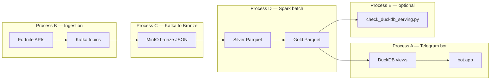

# Continuous parallel execution plan

> **Update:** Scheduled refreshes are now handled by **Apache Airflow**. See [airflow_orchestration.md](airflow_orchestration.md). The sections below describe the logical process model; `scripts/continuous_refresh.py` was deprecated in favor of Airflow DAGs.

This project keeps the **Telegram bot** (read-only serving) separate from **background data refresh** workers. The bot never writes to MinIO or Kafka; it only queries curated Gold data through DuckDB.

## Runtime model



### Process A — Telegram bot

- **Command:** `python -m bot.app`
- Long-running; answers menu queries via `QueryService`.
- DuckDB reads the latest Gold Parquet from MinIO (`direct_minio`) or from a local cache (`local_cache`).
- **Does not** run ingestion or Spark jobs.

### Process B — Ingestion scheduler (Airflow)

Airflow DAGs call existing ingestion modules on schedule:

| DAG | Schedule |
|-----|----------|
| `fortnite_metrics_refresh_dag` | Every 5 minutes |
| `fortnite_shop_refresh_dag` | Every 60 minutes |
| `fortnite_reference_refresh_dag` | Daily |

Example one-shot ingestion:

```bash
python -m ingestion.ingest_shop
python -m ingestion.ingest_cosmetics
python -m ingestion.ingest_islands
python -m ingestion.ingest_island_metrics
```

### Process C — Kafka → Bronze worker

Drains Kafka topics into MinIO bronze JSON (hive paths under `bronze/source=*`).

```bash
python scripts/kafka_to_bronze_once.py --topic fortnite.raw.island_metrics --max-messages 50
# or all topics:
python scripts/kafka_to_bronze_once.py --full --max-messages 100
```

Run every few minutes in demo, or on a schedule in production.

### Process D — Spark batch refresh

Transforms Bronze → Silver → Gold.

```bash
python scripts/run_bronze_to_silver.py --engine python
python scripts/run_silver_to_gold.py --engine python
```

- **Demo:** every 5–10 minutes (via `continuous_refresh.py` or a shell loop).
- **Production:** less frequent batches; use PySpark (`--engine spark`) when JVM/Spark is available.

Gold datasets include `gold/island_activity_anomalies/` (peakCCU spike detection).

### Process E — Serving validation (optional)

```bash
python scripts/check_duckdb_serving.py --mode direct_minio
```

Confirms DuckDB views and `QueryService` queries against current Gold data.

## Recommended local development

**Terminal 1 — infrastructure**

```bash
docker compose up -d
```

**Airflow — scheduled refresh**

```bash
docker compose --env-file .env up -d airflow-postgres airflow-init airflow-webserver airflow-scheduler
```

Open http://localhost:8080 and enable the refresh DAGs.

**Terminal 2 — Telegram bot**

```bash
python -m bot.app
```

**One-shot demo (all steps once)**

```bash
python scripts/demo_run.py --serving-mode direct_minio
```

## Fallback (no Airflow)

- **`scripts/deprecated/continuous_refresh.py`** — legacy loop for local debugging only.
- **Manual:** `python scripts/demo_run.py --serving-mode direct_minio`

## Data freshness

1. **Ingestion** refreshes API snapshots into Kafka.
2. **Kafka** buffers events between bronze writes.
3. **Bronze** stores raw JSON in MinIO.
4. **Silver/Gold** batch jobs materialize curated Parquet (including anomalies).
5. **DuckDB** re-reads Gold on each query connection (`direct_minio`) or after cache sync (`local_cache`).
6. **Bot** always hits the serving layer (`QueryService`), not APIs directly.

After a refresh cycle completes, restart is **not** required for the bot: new Gold files in MinIO are visible on the next DuckDB read.

## Limitations

- Airflow LocalExecutor runs tasks in the scheduler container — heavy jobs share one machine.
- Respect Fortnite API rate limits; full island metrics can take minutes.
- Many islands return **null** `peakCCU` — fewer top islands and anomalies.
- Anomaly detection needs **multiple metric points per island** in silver; single-point history produces no anomalies.
